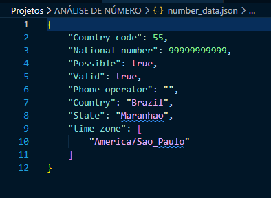
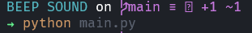
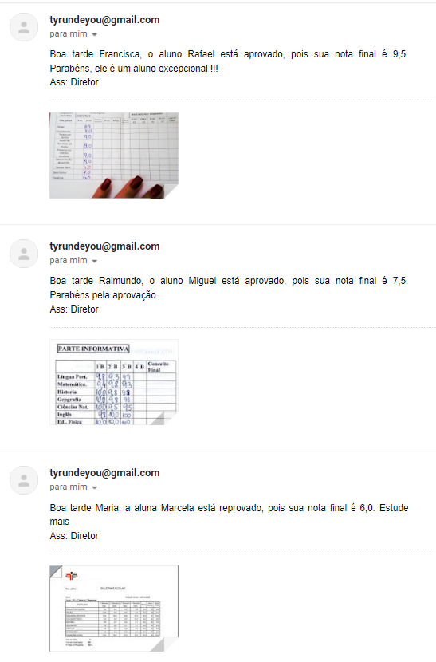
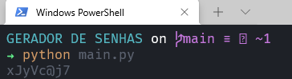
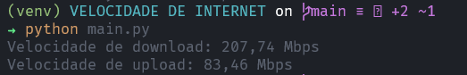

<h1>Projetos com Python</h1>

<h2>Sobre</h2>

Projetos simples com Python para prática de estudos, feitos no ano de 2021.

 

<h2>Resultados</h2>
<ul>

<li>
<h3>Análise de número de celular</h3>

</li> 

<li>
<h3>Beep sound</h3>

</li> 

<li>
<h3>Enviador de email</h3>

</li> 

<li>
<h3>Gerador de senha</h3>

</li> 

<li>
<h3>Velocidade de internet</h3>

</li> 

</ul>
